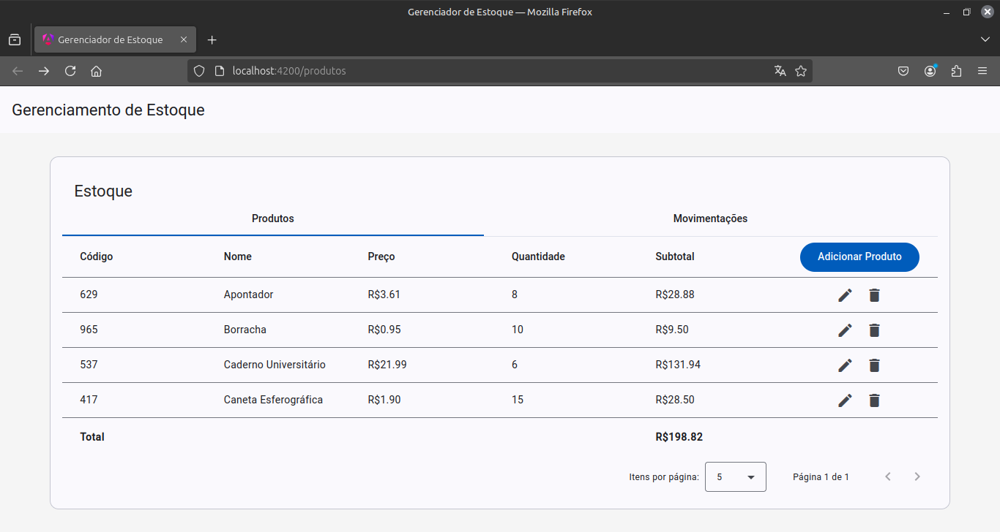
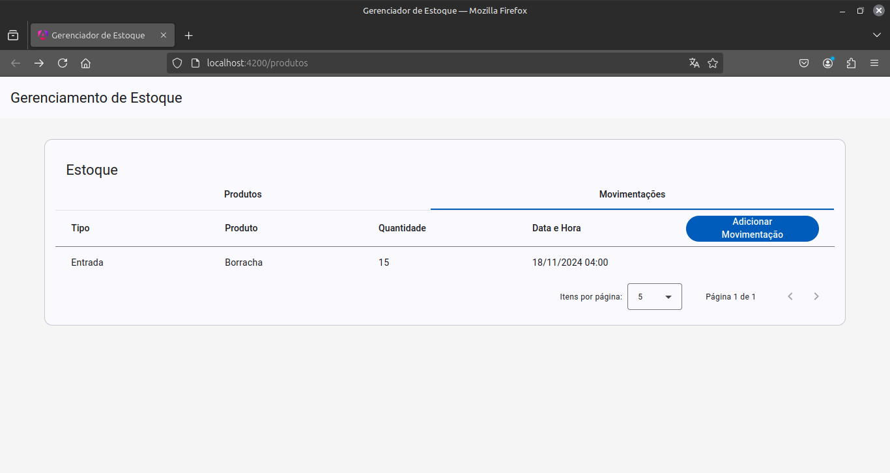
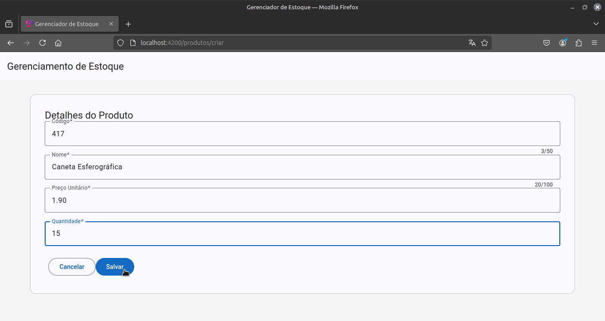
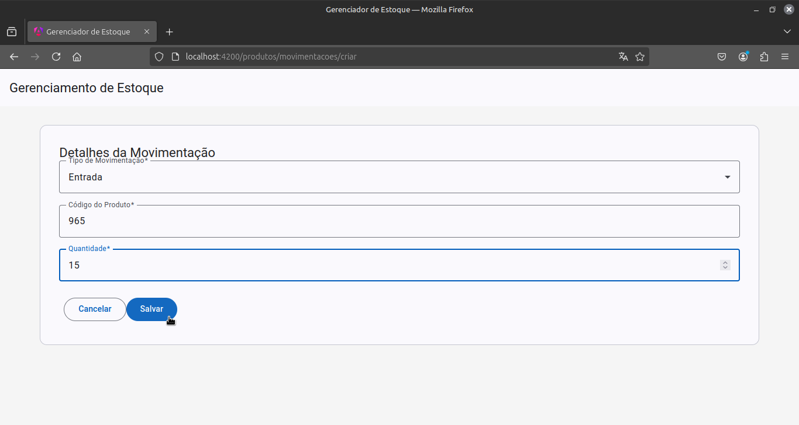

# Gerenciamento de Estoque

<div style="display:inline-block">
        <picture>
                <source media="(prefers-color-scheme: light)" srcset="https://img.shields.io/badge/Angular-black?style=for-the-badge&logo=Angular&logoColor=white">
                
        </picture>
</div>

## Visão Geral

Aplicação Angular simples de gerenciamento de estoque.

## Funcionalidades

- Adicionar, listar, atualizar e excluir produtos
- Adicionar e listar movimentações

## Capturas de Tela

### Tabela de Produtos



### Tabela de Movimentações



### Formulário de Criação de Produto



### Formulário de Criação de Movimentação



## Executar

Para executar a aplicação, é necessário ter Node.js/NPM instalado localmente.

Instale as dependências:
```
npm install
```
Execute o projeto:
```
npm run start
```
Acesse http://localhost:4200 no browser.
